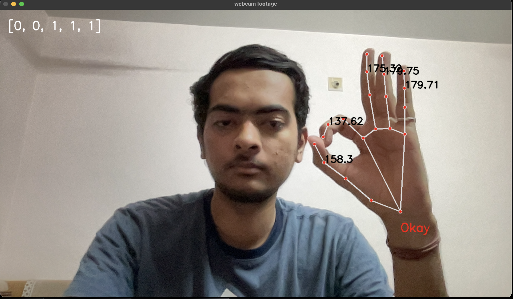
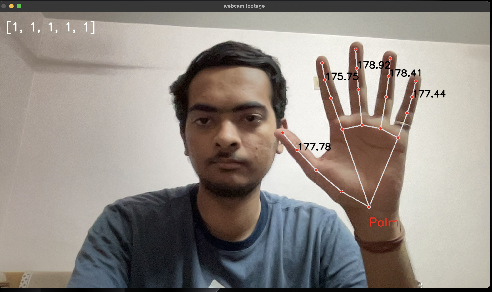
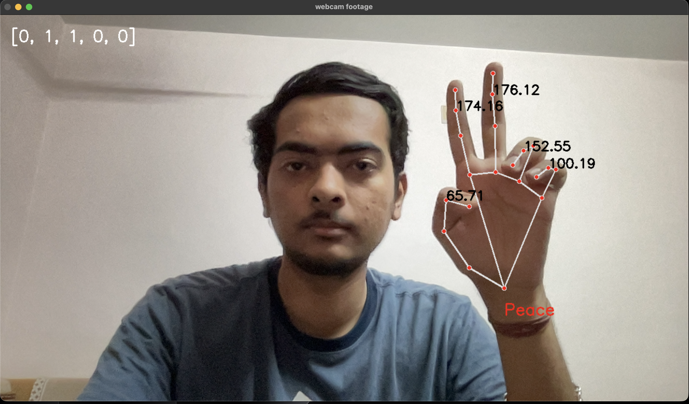
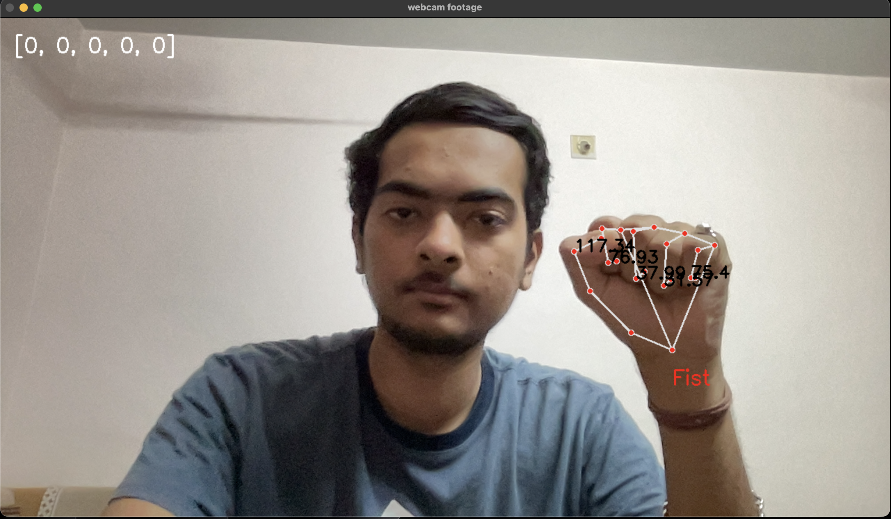
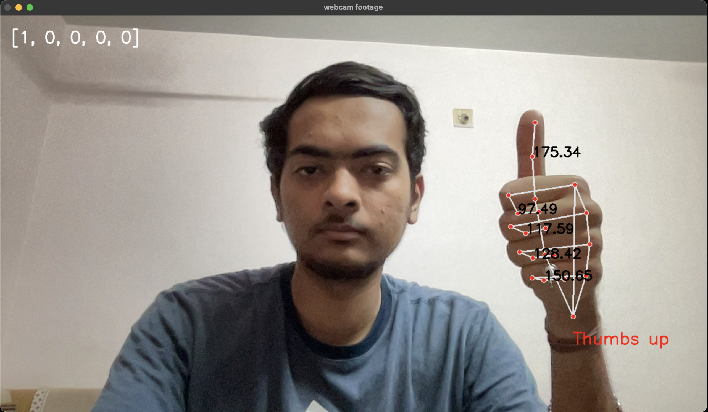

# Hand Sign Language Detection using MediaPipe

Real-time hand sign language detection system built using **MediaPipe** and **OpenCV**. Detects 5 hand gestures live from a webcam feed using a geometry-based finger angle classification approach — no deep learning model required.

---

## Demo

| Okay | Palm | Peace |
|:----:|:----:|:-----:|
|  |  |  |

| Fist | Thumbs Up |
|:----:|:---------:|
|  |  |

---

## About the Project

Most sign language detection projects rely on deep learning models trained on large datasets. This project takes a **lightweight geometry-based approach** — using MediaPipe hand landmarks to compute finger joint angles in real time and classify gestures based on finger state logic.

This means the system runs entirely on CPU with no model training required, making it fast, explainable, and easy to extend with new gestures.

### How it works

MediaPipe detects 21 hand landmarks per frame. For each finger, three landmark points are used to compute the joint angle using the **dot product formula**:

```
angle = arccos( (BA · BC) / (|BA| × |BC|) )
```

If the angle at a finger joint exceeds 170° the finger is considered **extended (1)**, otherwise **bent (0)**. This produces a 5-element binary finger state array that uniquely maps to each gesture.

---

## Detected Gestures

| Gesture | Finger State Array | Description |
|---------|:-----------------:|-------------|
| Thumbs Up | `[1, 0, 0, 0, 0]` | Only thumb extended |
| Okay | `[0, 0, 1, 1, 1]` | Thumb + index form circle, others extended |
| Peace | `[0, 1, 1, 0, 0]` | Index and middle fingers extended |
| Fist | `[0, 0, 0, 0, 0]` | All fingers bent |
| Palm | `[1, 1, 1, 1, 1]` | All fingers fully extended |

> The finger state array follows the order: `[Thumb, Index, Middle, Ring, Pinky]`
> `1` = extended, `0` = bent

---

## Tech Stack

- **Language**: Python 3.11
- **Libraries**: `mediapipe`, `opencv-python`, `numpy`
- **Approach**: Geometry-based finger angle classification
- **Hardware**: Runs real-time on CPU — no GPU needed

---

## Project Structure

```
hand-sign-language-detection/
│
├── assets/                  # Demo screenshots
│   ├── okay.png
│   ├── palm.png
│   ├── peace.png
│   ├── fist.png
│   └── thumbs_up.png
│
├── sign-language.py         # Main detection script
├── requirements.txt
└── README.md
```

---

## Getting Started

### 1. Clone the repository

```bash
git clone https://github.com/dhruvhsuthar/hand-sign-language-detection.git
cd hand-sign-language-detection
```

### 2. Install dependencies

```bash
pip install -r requirements.txt
```

### 3. Run the detection

```bash
python sign-language.py
```

Press `q` to quit the webcam window.

---

## Requirements

```
mediapipe>=0.10.0
opencv-python>=4.8.0
numpy>=1.24.0
```

---

## How Finger Angle Classification Works

Each finger uses 3 landmark points — tip, middle joint, and base joint. The angle at the middle joint determines if the finger is extended or bent:

```python
def calculate_angle(a, b, c):
    a, b, c = np.array(a), np.array(b), np.array(c)
    ba = b - a
    bc = b - c
    cosine_angle = np.dot(ba, bc) / (np.linalg.norm(ba) * np.linalg.norm(bc))
    return np.degrees(np.arccos(cosine_angle))

# If angle > 170° → finger is extended (1)
# If angle ≤ 170° → finger is bent (0)
```

The 5 finger states are combined into an array and matched against known gesture patterns for classification.

---

## What I Learned

- MediaPipe hand landmark detection pipeline and 21-point hand skeleton structure
- Computing joint angles using dot product and arccos for finger state classification
- Building a rule-based gesture recognition system without any training data
- Real-time webcam inference optimization using OpenCV

---

## Future Improvements

- [ ] Expand gesture vocabulary to include full ASL alphabet (A–Z)
- [ ] Add two-hand gesture support for more complex signs
- [ ] Replace rule-based classification with a trained ML classifier for more complex gestures
- [ ] Build a Streamlit web app for browser-based gesture detection

---

## Author

**Dhruv Suthar**
- GitHub: [@dhruvhsuthar](https://github.com/dhruvhsuthar)
- LinkedIn: [@Dhruv Suthar](https://www.linkedin.com/in/dhruv-suthar-50b57a371/)

---

